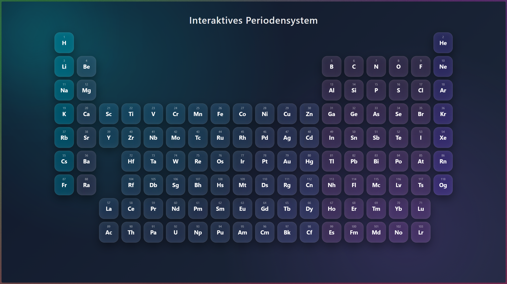

# 🧪 Modernes Interaktives Periodensystem

Ein minimalistisches, interaktives Periodensystem mit modernem Glassmorphism-Design und animierten Popups.

Dieses Projekt kombiniert ästhetisches UI-Design mit chemischen Grunddaten.  
Beim Klick auf ein Element öffnet sich ein animiertes Modal mit:

- Ordnungszahl  
- Atommasse  
- Protonen  
- Neutronen  
- Elektronen  

Die gesamte Anwendung läuft vollständig clientseitig mit HTML, CSS und JavaScript.

---

---

## ✨ Features

- Modernes Glas-Design (Blur + Transparenz)
- CSS Grid Layout
- Animierte Modal-Transitions
- Weiche Easing-Animationen
- Farblich codierte Elementgruppen
- Alle 118 Elemente enthalten
- Komplett ohne Frameworks

---

## 🚀 Live Version

Sobald GitHub Pages aktiviert ist, ist das Projekt erreichbar unter:

https://nuri1400.github.io/periodensystem/

---

## 🎨 Design-Konzept

Das visuelle Konzept basiert auf:

- Radialen Hintergrundverläufen
- Transparente Layer mit `backdrop-filter`
- Sanften Schatten
- Abgerundeten Ecken für moderne App-Optik
- Transform-Animationen mit cubic-bezier easing

Ziel war es, ein Periodensystem zu entwickeln, das sich wie eine moderne App anfühlt – nicht wie eine statische Tabelle.

---

## ⚙️ Verwendete Technologien

- HTML5
- CSS3 (Grid, Blur, Transforms)
- Vanilla JavaScript
- GitHub Pages (Hosting)

Keine Frameworks. Kein Build-System. Keine Abhängigkeiten.

---

